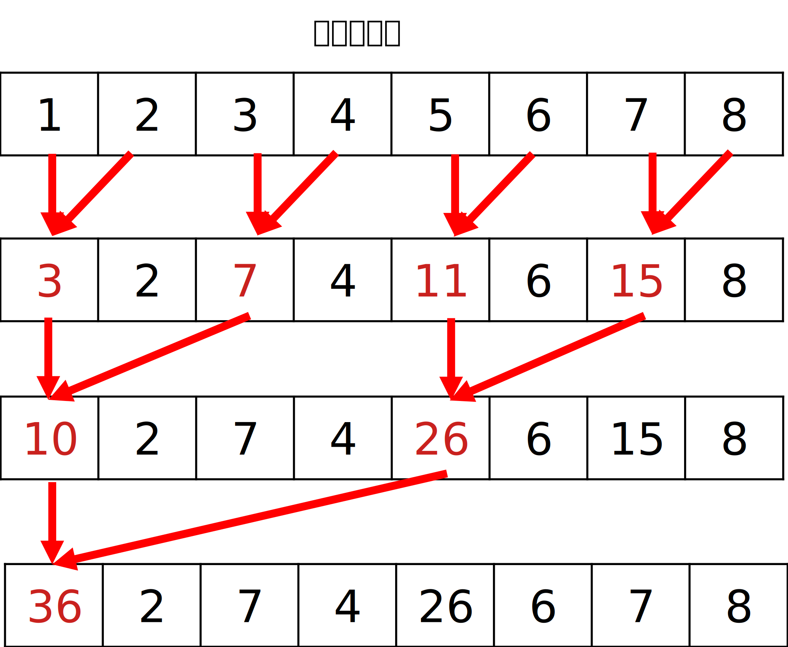
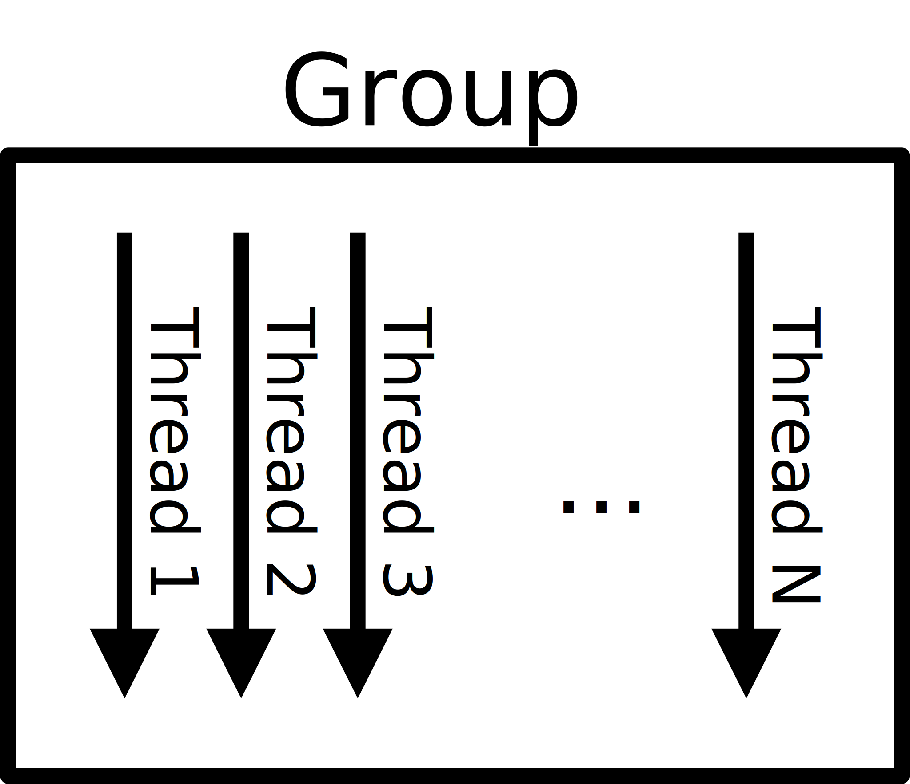
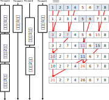
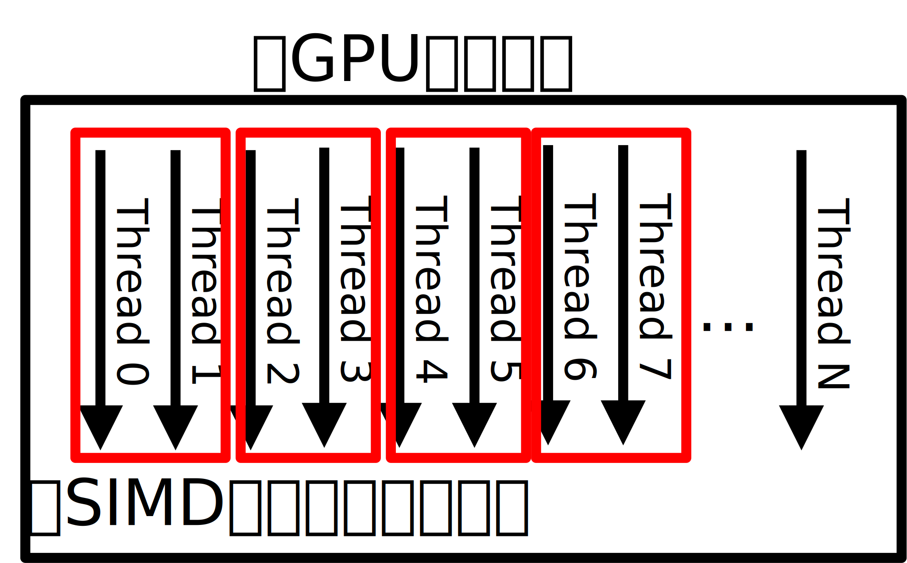

# 4. GPUコアの構造と同期と集約処理
この章では，GPUで集約処理(reduction, folding, aggregation)をやっていきます．
集約処理は，例えば，配列の要素の最大値を求めるだとか，配列の要素の合計を求めるとかです．

## 4.1. グループ内でのバリア - 256個の配列を256並列でやってみる(S1Parallel256)
`S1Parallel16`は16個の要素を合計する関数です．
変数`SIZE`は，
```csharp
int SIZE = Math.Min(256, accelerator.MaxNumThreadsPerGroup);//256;
// ...
int[] ary = new int[SIZE];
// ...
gpuKernel(SIZE, gpuArray.View, ary.Length);
```
要素を合計する配列の要素数とカーネルの並列実行数となります．
単純に16と指定せずに，`Math.Min(256, accelerator.MaxNumThreadsPerGroup)`としているのは，ただ単に256としてもうまくいかない場合があるからです．考えなくて良いです．
```csharp
for(int i = 0; i < ary.Length; ++i)
    ary[i] = i+1;
```
配列`ary`には，`1`から`SIZE`までの値が代入されます．合計は，`(1+SIZE)*SIZE/2`となります．
`SIZE`が`256`であれば，`32896`になるはずです．

アルゴリズムは，次の図がわかりやすいです．



ループ変数`i`は2倍2倍となされ，`index % (i*2) == 0`の時に，`index`番目と`index + i`番目の値が足されます．  
最初は1から始まりますので`index`が偶数のとき，`index`番目の値とその隣の値が足されます．そして，次に2になり，`index`が4の倍数のとき，`index`番目の値と2個隣の値が足されます．

### 4.1.1. 実行してみよう
実行をしてみましょう．
```csharp
S1Parallel256();
```

```
==RESULT==
GPU:
  Result: 32896
  Time  : 00:00:00.0037481
CPU:
  Result: 32896
  Time  : 00:00:00.0000087
==========
```

うまく`32896`になった環境と，そうでない環境があるでしょう．私の環境では正しく計算されました．  
では，18行目，19行目をコメントアウトしてみてください．これは3の倍数のインデックスはただ`a`と出力するだけのコードです．
```csharp
if(index % 3 == 0)
    Interop.Write("a");
```

再び実行をしてみると，

```
==RESULT==
GPU:
  Result: 2470
  Time  : 00:00:00.0086842
CPU:
  Result: 32896
  Time  : 00:00:00.0000056
==========
```

結果が異なってしまいました．ただ，画面出力しただけなのに，です．
これを直すには，**バリア**を用いる必要があります．

### 4.1.2. バリアを使って同期を取ろう
さて，21行目をコメントアウトしてみましょう．
```csharp
Group.Barrier();
```

```
==RESULT==
GPU:
  Result: 32896
  Time  : 00:00:00.0085573
CPU:
  Result: 32896
  Time  : 00:00:00.0000077
==========
```

正しく動くようになったはずです．
この，`Group.Barrier`は何をしているのでしょうか？
順を追って説明します．

### 4.1.3. スレッドとグループ
GPUは並列に計算を行いますが，並列に計算が行われる計算の流れの一つを**スレッド**（Thread）と呼びます．並列数が2であれば，2スレッドで動いている，という風に，一度に実行できる計算数がスレッドの数となります．  
例えば，3章で`S1ArrayFirstStep`関数を扱いましたが，1つめのスレッドは，配列の0番目，つまり，1を2倍にします．2つめのスレッドは，配列の1番目，つまり，2を2倍する処理を行うわけです．  
1つめのスレッドをスレッド0，2つめのスレッドをスレッド1…という風に呼ぶことにします．  

さて，先ほど用いた`Group.Barrier`には，**グループ**（Group）が出てきました．これは，スレッドの集まりのことを示します．



さて，最初に
```csharp
int SIZE = Math.Min(256, accelerator.MaxNumThreadsPerGroup);//256;
```
としましたが，この`accelerator.MaxNumThreadsPerGroup`はグループにいくつのスレッドがあるかを示したものです．おそらく，多くのGPUは`256`よりも大きくなるはずですが，`256`よりも少なかった場合，今回のコードはうまく動かなくなります．そのため，`Math.Min`によって，小さい方を採用しています．

### 4.1.4. グループ間バリア

そして，**バリア**（Barrier）は，同期をとる地点となります．グループの中にあるたくさんのスレッドは，別々に処理が実行され，みなが同じタイミングで同じ箇所の処理を終わらせるとは限りません．そのため，バリアと呼ばれる地点を指定することで，その地点にすべてのスレッドが達するまで次の処理を行わないようにすることができます．

**バリア**が無いとどのように実行されるのでしょう？  
次の図がわかりやすいと思います．



この例はスレッド4が遅れている例です．途中までは計算結果が間違えていなくもないです．しかし，スレッド0がループ3回目を始めるときに，`11 + 15`の結果がまだ代入されておらず，Thread4の1回目のループの結果である`11`を計算に用いてしまいました．その結果，正しい結果よりも15少なくなってしまいました．  
このようなことを防ぐために，各ループの終了地点で各スレッドが歩調を合わせる必要があります．そのために，`for`文の最後にバリアを入れました．

### 4.1.5. グループとスレッドの他の呼び方
さて，グループとスレッドというのはプログラム抽象（概念）です．ILGPUではこの用語を用いていますが，CUDAやOpenCLでは異なった呼び方をします．

| ILGPU  |     CUDA     |   OpenCL  |
|--------|--------------|-----------|
| Group  | Thread Block | WorkGroup |
| Thread | CUDA Thread  | Work Item |

また，ILGPUにおける
```csharp
Group.Barrier();
```
は，CUDAでは，
```c
__syncthreads();
```
OpenCLでは，
```c
barrier();
```
と書きます．

### 4.1.6. グループとスレッドは実際にはどのように実行されるのか
では，実際にグループやスレッドはどのように割り当てられ，実行されるのでしょうか．プログラム抽象と実装が一対一対応で実行されると（理解が簡単で）嬉しいのですが，そうはいきません．  
まず，1つのグループは1つの「GPUのコア」で実行されます．その「GPUのコア」にはいくつかの「SIMDスレッドのコア」があり，そこでいくつかのスレッドが同時実行されます．1つのスレッドを実行するハードウェアのことを「SIMDレーン」と呼ぶことが多く，「SIMDスレッドのコア」が同時に8つのスレッドが実行ならば，「SIMDレーン」は「SIMDスレッドのコア」に8つあることがいえます．（「GPUのコア」と「SIMDスレッドのコア」については一般的な名称ではありません．）



そして，それぞれについて，各社，別々の言い方がなされています．

|   本書    |   AMD(DNA)     |  AMD(GCN)  | Intel | nVidia |
|   ----    | -------------- | ----- | ----- | ------ |
| GPUのコア | WorkGroup Processor | Compute Unit | Sub Slice | Streaming Multiprocessor（たまにSMX） |
| SIMDスレッドのコア | Wavefront | Wavefront | Execution Unit | Warp
| SIMDレーン | SIMDレーン | SIMDレーン | SIMDレーン | Thread Processor（またはCUDAコア）

さて，ここに
 * SM数82のGeForce RTX 3090
 * 80CUのRadeon RX 6900 XT
 * 512EUのIntel Xe-HPG Alchemist

があります．どれが一番SIMDスレッドのコア数が少ないでしょうか？
（1SMあたり32Warp，1CUあたり4Wave）

# 参考文献
 * Mark Harris : Optimizing Parallel Reduction in CUDA(NVIDIA Developer Technology), available at: https://developer.download.nvidia.com/assets/cuda/files/reduction.pdf
 * John L Henecy, David A Patterson: COMPUTER ARCHITECTURE : A Quantative Approach 6th Edition [RISC-V] (The Morgan Kaufmann Series in Computer Architecture and Design) , Morgan Kaufmann, 2017.12.7 (chapter 4)
 * Areej : Intel Gen12 Xe Graphics Architectural Deep Dive: The Bigger, the Better(hardwaretimes), available at: https://www.hardwaretimes.com/intel-gen12-xe-graphics-architectural-deep-dive-the-bigger-the-better/
 * Lars Nyland, Stephen Jones : Inside Kepler(GPU Technology Conference), available at : https://on-demand.gputechconf.com/gtc/2012/presentations/S0642-GTC2012-Inside-Kepler.pdf
 * 